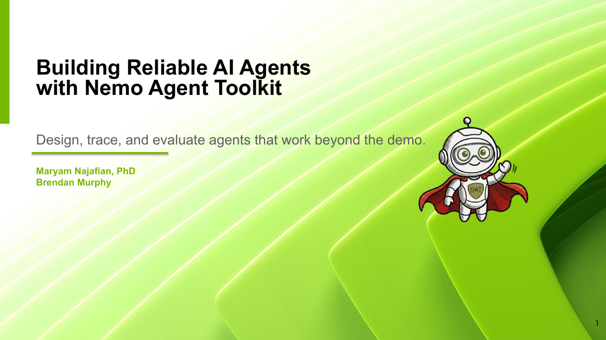

# Building Reliable AI Agents with NeMo Agent Toolkit

*Companion lab for [UC Berkeley EE 290/194: Scalable AI](https://scalable-ai.eecs.berkeley.edu/S2026/), Spring 2026*

LLM agents can search the web, run code, read files, and complete multi-step tasks, but making them reliable remains difficult. A wrong tool choice, an ineffective search, or an incorrectly formatted answer can cause an otherwise capable agent to fail.

In this lab, you will run agents against real questions, inspect their traces, change their configurations, and measure whether your changes improve the results.

## What You Will Learn

- **How agents execute tasks.** Follow model calls, tool calls, intermediate results, and routing decisions through a complete run.
- **Why architecture matters.** Compare a flat agent, a multi-agent orchestrator, and an agent that uses prompt-based routing.
- **How to diagnose and improve agents.** Use traces to identify unnecessary tool calls, weak routing decisions, and formatting failures, then make focused changes.
- **How to evaluate your changes.** Run GAIA questions, compare results, and submit your agent to a public leaderboard.

The repository includes four reference agents that score between 85% and 90% on the leaderboard. Use them as starting points, inspect where they fail, and build a stronger agent.

## Tools You Will Use

- **[NeMo Agent Toolkit](https://github.com/NVIDIA/NeMo-Agent-Toolkit):** NVIDIA's open-source toolkit for building, profiling, evaluating, and optimizing agent workflows. The agents in this lab are configured in YAML.
- **[Phoenix](https://docs.arize.com/phoenix):** An observability interface for exploring model calls, tool calls, routing decisions, latency, and other trace data.
- **[GAIA](https://arxiv.org/abs/2311.12983):** A benchmark of real-world questions that require reasoning, tool use, and precise answers. The development set includes expected answers for iteration, while the test set supports final benchmarking.

## Lecture Slides

<div align="center">
  <a href="materials/building-reliable-ai-agents-with-nemo-agent-toolkit-2026.pdf">
    
  </a>
  <br>
  <strong>
    <a href="materials/building-reliable-ai-agents-with-nemo-agent-toolkit-2026.pdf">
      Open the 62-slide lecture deck &rarr;
    </a>
  </strong>
</div>

The lecture begins with agent foundations and common production failure modes, then shows how NeMo Agent Toolkit supports the agent lifecycle. Students build and trace an agent, examine its configuration and plugin architecture, compare agent and orchestration patterns, and use Phoenix and GAIA to evaluate and improve their designs.

Review the slides for the concepts behind the lab. Then complete the [Quick Start](#quick-start) and follow the [guided agent lab](lab/lab-guide.md).

## Quick Start

```bash
git clone https://github.com/mnajafian-nv/nat-agent-lab.git nat-agent-lab
cd nat-agent-lab
bash setup.sh          # ~20 min; prompts for API keys, downloads model
./ask                  # start chatting
```

Setup takes 20-30 minutes (model download, dependencies, API keys). See [Setup](#setup) for details. There is a [GPU path](#path-a-gpu-instance-three-agents) and an [Ollama path](#path-b-local-ollama-one-agent-no-gpu) if you don't have GPUs.

You should see a status line like `Agent: ultrafast | vLLM: OK | NAT: OK | Phoenix: OK`. If anything looks wrong, type `status` for diagnostics. Try asking "What is 2+2?" to confirm the agent responds.

## What to Try

Once you see the `ask>` prompt, work through these steps in order.

### 1. Ask a question

```
ask> What is the tallest building in San Francisco?
```

The agent searches the web, reasons over the result, and answers. Type a follow-up and the agent remembers context. The prompt shows your turn count (`ask [1]>` after the first exchange, `ask [2]>` after the second, etc.).

### 2. Run a GAIA dev question

```
ask [1]> level dev 1, 1
```

This runs the first question from GAIA Level 1 (dev set). The agent works through it with tool calls, and then the expected answer is shown so you can compare. Notice the timing: `./ask` prints how long the agent took.

After it finishes, you can ask follow-ups like "why did you use that tool?" or "explain your reasoning" since the Q&A is already in memory.

Some useful commands:
- `level dev 1` - list all Level 1 dev questions (with answers for checking)
- `level 1` - list Level 1 test questions (no answers, for benchmarking)
- `level` - summary of all levels

### 3. Open Phoenix (traces)

Start Phoenix **before** running agent comparisons so traces are captured.

```
ask [1]> tracing
```

If you're on a remote machine (Brev, GCP), forward port 6006 first from a **separate terminal on your laptop**:

```bash
ssh -L 6006:localhost:6006 <your-ssh-host>
```

Then open [http://localhost:6006](http://localhost:6006) and keep it open in a tab. Your runs from steps 1 and 2 are already there. Phoenix is optional. Agents work fine without it, you just won't see the traces.

### 4. Compare agents on the same question

Pick a dev question so you have an expected answer to judge against. `level dev 1, 1` is a good choice because it needs multiple tool calls and computation, which is where architecture differences show up.

You already have a trace for the default agent (ultrafast) from step 2. Now run the same question on the other two:

```
ask [1]> switch single
ask> level dev 1, 1
ask [1]> switch multi
ask> level dev 1, 1
```

After each run, refresh Phoenix. Click into a trace to see the full agent loop: system prompt, tool calls, intermediate results, final answer. Compare latencies per span to see where time is spent.

| Agent | What to look for |
|-------|-----------------|
| **Ultrafast** *(default)* | Your baseline. How does the system prompt classify the question before any tool call? |
| **Single** | No routing. Does it call tools that Ultrafast would have skipped? More or fewer LLM round-trips? |
| **Multi** | Extra LLM call for the orchestrator. Is the routing accurate? Is the specialist's focused context worth the latency? |

**Bonus:** try a simple factual question like "What is the capital of France?" (zero tools needed). All agents should answer instantly. If Multi is noticeably slower, that's the cost of orchestrator overhead on a question that didn't need routing.

The takeaway: the best architecture depends on the task. Flat agents are faster on simple questions; routing pays off on complex multi-tool questions. Traces make this measurable.

### 5. Run the benchmark

```
ask [1]> benchmark
```

Pick an agent and run 20 scored questions (~15 min). Your answers are submitted and your team appears on the [public leaderboard](https://huggingface.co/spaces/agents-course/Students_Leaderboard) within seconds. You'll be prompted for your org and team name. The leaderboard entry follows the format `NAT-<org>-<team>-<agent>` (e.g., `NAT-UCB-TeamAlpha-Ultrafast`).

While the benchmark runs, go back to Phoenix and dig into the traces from step 4. This score is your baseline to beat in step 6.

### 6. Build your own agent

The built-in agents are baselines. Open their YAML configs, read the system prompts, look at traces to see where they fail, then improve on them.

```bash
mkdir my-agent
cp ultrafast-agent/gaia_agent_ultrafast.yml my-agent/config.yml
# edit config.yml: refine the system prompt, add/remove tools, change the agent type
```

Load it in `./ask`:

```
ask> switch my-agent/config.yml
```

**What to optimize** (change one variable at a time, measure before and after):

- **Cut unnecessary tool calls.** Check traces. Is the agent calling `internet_search` when the answer is in the question? Add explicit guidance to the system prompt about when to use each tool.
- **Remove unused tools.** Fewer tools = shorter tool schema in the prompt = fewer input tokens per LLM call = faster inference. Check traces to see which tools actually get called.
- **Add prompt-driven routing.** The ultrafast agent classifies questions into TYPE A/B/C/D categories in the system prompt before making any tool call. Read its config to see how.
- **Try a different agent type.** `tool_calling_agent` uses the LLM's native function-calling format. `react_agent` uses ReAct-style Thought/Action/Observation prompting. These need different system prompts, so don't just swap the `_type` field. See [NAT examples](https://github.com/NVIDIA/NeMo-Agent-Toolkit/tree/main/examples) for working configs.
- **Tune `temperature` and `seed`.** Lower temperature (0.0-0.1) makes tool selection more deterministic. Setting `seed` improves reproducibility (local vLLM only). Run the same question 3 times to measure variance.
- **Tighten answer formatting.** GAIA exact-match scoring is strict. If the agent gets the right answer but wraps it in extra text, add formatting rules to the system prompt.
- **Reduce latency.** Total time = (LLM calls x per-call latency) + tool time. Target fewer LLM calls and shorter prompts.

**On swapping models:** each LLM has its own `max_tokens`, `temperature` range, chat template, and tool-calling format. If you change `model` in your YAML, adjust these parameters to match. The built-in configs are tuned for MiniMax M2.5 (vLLM) and Qwen3.5 35B-A3B (Ollama). See [NAT examples](https://github.com/NVIDIA/NeMo-Agent-Toolkit/tree/main/examples) for other models.

**The iteration loop:** edit YAML, run a `level dev` question, check traces, repeat. When you're confident, run `benchmark custom` to submit your score.

**Compete on three fronts:**

1. **Accuracy** (leaderboard score). The built-ins score 85-90%. Can you beat them?
2. **Speed** (benchmark time). Check `gaia_summary.json` for per-question timing. A faster agent at the same accuracy is a better agent.
3. **Design** (trace quality). Open your traces and a built-in's side by side. Fewer tool calls, cleaner routing, shorter prompts. Be ready to explain what you changed and why.

## Agent Architectures

The GPU agents (single, multi, ultrafast) share the full tool set: `internet_search`, `wiki_search`, `read_file`, `fetch_url`, `python_executor`, `describe_image`, `describe_image_alt`, `transcribe_audio`, `get_youtube_transcript`, `solve_chess`, `current_datetime`. The Ollama-served agent has most of these but skips `describe_image_alt` to keep context smaller.

| Agent | Config | Architecture | LLM | Key difference |
|-------|--------|-------------|-----|----------------|
| **Single** | [`single-agent/gaia_agent.yml`](single-agent/gaia_agent.yml) | Flat `tool_calling_agent` with direct access to all tools | MiniMax M2.5 456B MoE (vLLM serving) | Simplest design. One LLM call per tool step, no routing overhead. |
| **Multi** | [`multi-agent/gaia_agent_multi.yml`](multi-agent/gaia_agent_multi.yml) | Orchestrator dispatches to 3 specialist sub-agents (web, file, multimedia) | MiniMax M2.5 456B MoE (vLLM serving) | Extra LLM call for routing, but specialists get focused prompts and tools. |
| **Ultrafast** | [`ultrafast-agent/gaia_agent_ultrafast.yml`](ultrafast-agent/gaia_agent_ultrafast.yml) | Flat agent with TYPE A/B/C/D routing baked into the system prompt | MiniMax M2.5 456B MoE (vLLM serving) | Same flat architecture as Single, but prompt-driven routing skips the orchestrator call. |
| **Ollama Ultrafast** | [`ultrafast-ollama-agent/gaia_agent_ultrafast_ollama.yml`](ultrafast-ollama-agent/gaia_agent_ultrafast_ollama.yml) | Same design as Ultrafast, running locally via Ollama | Qwen3.5 35B-A3B (Ollama serving) | No GPU needed, no API keys for inference. Default is a MoE model (35B total / 3B active), needs 32+ GB RAM. |

Each agent is defined entirely by its YAML config. NAT supports additional architectures (`react_agent`, `router_agent`, `sequential_executor`, etc.). See step 6 for how to experiment.

**Ollama notes:** Qwen3.5 35B-A3B needs ~24 GB disk and ~32 GB RAM. It is a MoE model (35B total / 3B active) from the latest Qwen 3.5 generation, with fast inference and strong tool-calling. Vision and audio tools (`describe_image`, `transcribe_audio`) still work because they call external APIs, not the local model. They do require an NGC_API_KEY. For best GAIA accuracy, use the GPU agents.

## Two Question Sets

The repo includes two sets of GAIA questions:

- **Test set** (`gaia_questions.json`, 301 questions) - no expected answers. Use `level` commands to browse and run these. The `benchmark` command scores against the HuggingFace leaderboard.
- **Dev set** (`gaia_dev_questions.json`, 165 questions) - with expected answers. Use `level dev` commands. These are for tuning your agent: run a question, see if the answer matches, check the trace, iterate.

Use the dev set to improve your agent. Use the test set (via `benchmark`) to measure your final score.

## Conversation Memory

`./ask` is multi-turn: the agent remembers your conversation and can answer follow-ups. The prompt shows the turn count (e.g., `ask [3]>`). Memory is kept for up to 20 turns, then oldest turns are trimmed.

Three things clear memory:

- **`clear`** - manually reset without restarting
- **`switch`** - changing agents always clears memory
- **`level` / `level dev`** - GAIA questions are sent standalone (no prior context) so the agent can't be confused by earlier turns. After the answer, the Q&A is seeded into memory for follow-ups.

If a question fails (timeout, API error), the failed message is removed from memory so it doesn't affect future turns.

## Commands

Type `help` in `./ask` for the full list. Key commands:

| Command | What it does |
|---------|-------------|
| `level` | Show test questions (no answers) |
| `level <L>, <N>` | Run test question N from Level L |
| `level dev` | Show dev questions (with expected answers) |
| `level dev <L>, <N>` | Run dev question with answer checking |
| `benchmark [agent]` | Run 20-question scored leaderboard |
| `switch [agent]` | Change agent or load a custom config. Clears memory. |
| `clear` | Reset conversation memory |
| `info` | Current agent, model, and tools |
| `status` | Service and API key health |
| `tracing` | Start Phoenix and open traces in browser |
| `verbose on/off` | Show/hide full model reasoning |
| `help` | Full command reference |
| `quit` | Exit (Ctrl+C also works) |

## Setup

### Path A: GPU instance (three agents)

This path gives you all three GPU-powered agents, each using MiniMax M2.5 456B MoE served by vLLM:

1. **Single**: flat `tool_calling_agent` with direct access to all tools. Simplest design, no routing overhead.
2. **Multi**: orchestrator dispatches to three specialist sub-agents (web, file, multimedia). Extra LLM call for routing, but specialists get focused prompts.
3. **Ultrafast** *(default)*: flat agent with TYPE A/B/C/D routing baked into the system prompt. Same architecture as Single, but prompt-driven classification before each tool call.

The Ollama agent (Path B) is for users without GPUs. If you have a GPU instance, use these three agents.

**What you need:**
- Linux with **8 GPUs, ~640 GB VRAM total** (e.g., 8x H100 80GB, 8x A100 80GB). Tested on GCP `a3-highgpu-8g` and Brev `8xH100`.
- **300 GB free disk** for [MiniMax M2.5](https://huggingface.co/MiniMaxAI/MiniMax-M2.5) model weights (~220 GB).
- **NVIDIA drivers** installed (`nvidia-smi` should show all 8 GPUs).
- Python 3.10+ and `tmux` (pre-installed on most GPU cloud images).
- **3 API keys** (free tiers work). Sign up before running setup so you have them ready: [Tavily](https://tavily.com/), [NVIDIA Build](https://build.nvidia.com/), [HuggingFace](https://huggingface.co/settings/tokens). See [API Keys](#api-keys) below.

**Steps:**

```bash
git clone https://github.com/mnajafian-nv/nat-agent-lab.git nat-agent-lab
cd nat-agent-lab
bash setup.sh                        # ~20 min; prompts for API keys, downloads model
bash gaia_tools/start_services.sh    # ~5-10 min (vLLM loads model into GPU memory)
./ask                                # verify status line shows all OK
```

You should see `Agent: ultrafast | vLLM: OK | NAT: OK | Phoenix: OK`. All agents are available via `switch`.

### Path B: Local Ollama (one agent, no GPU)

This path gives you a single agent: **Ollama Ultrafast**, which uses the same prompt-driven design as Ultrafast but runs Qwen3.5 35B-A3B locally via Ollama instead of MiniMax M2.5 on GPU. Only the `ollama` agent is available; the three GPU agents (single, multi, ultrafast) require Path A.

**What you need:**
- macOS (Apple Silicon M1/M2/M3/M4) or Linux. No GPU required.
- **32 GB RAM required** (the default 35B-A3B model uses ~24 GB).
- **2 API keys required**: [Tavily](https://tavily.com/) (search) and [HuggingFace](https://huggingface.co/settings/tokens) (dataset). [NVIDIA Build](https://build.nvidia.com/) is optional (only needed for vision and audio tools).
- No Ollama pre-install needed. `setup.sh` installs it automatically.

**Steps:**

```bash
git clone https://github.com/mnajafian-nv/nat-agent-lab.git nat-agent-lab
cd nat-agent-lab
bash setup.sh    # auto-detects no GPU; installs Ollama, pulls model, prompts for keys
./ask            # start chatting
```

Then at the prompt:
```
switch ollama
```

`setup.sh` auto-detects that you have no GPU and handles everything: installs Ollama if needed, pulls qwen3.5:35b-a3b (requires 32+ GB RAM), sets up the Python environment, and prompts for API keys.

You should see `Agent: ollama | vLLM: off (not needed) | NAT: OK`. The agent runs locally. Only Tavily (web search) and HuggingFace (dataset) need API keys.

**Trade-offs:** Qwen3.5 35B-A3B is smaller than MiniMax M2.5 456B (Path A), so accuracy on harder questions will be lower. However, the MoE architecture gives fast inference with strong tool-calling, partially closing the gap. Path B is great for experimenting without a GPU; use Path A for best accuracy.

### API Keys

`setup.sh` prompts for all three keys interactively and saves them to `.env`. **Sign up before running setup** so you have the keys ready. Path B (Ollama) only needs Tavily and HuggingFace.

| Key | Sign up | Used for |
|-----|---------|----------|
| **Tavily** | [tavily.com](https://tavily.com/) | Internet search tool |
| **NVIDIA Build** | [build.nvidia.com](https://build.nvidia.com/) | Vision and audio tools (Path A; optional for Path B) |
| **HuggingFace** | [huggingface.co/settings/tokens](https://huggingface.co/settings/tokens) | GAIA dataset download and leaderboard submission |

**Tavily (TAVILY_API_KEY):**
1. Go to [tavily.com](https://tavily.com/) and sign in with Google (or use your university/org account).
2. Your API key is on the dashboard after signing in. Copy it.

**NVIDIA Build (NGC_API_KEY):**
1. Go to [build.nvidia.com](https://build.nvidia.com/) and click **Login** (top right).
2. Create an NVIDIA account if you don't have one (verify by email and phone).
3. Once logged in, go to [build.nvidia.com/settings/api-keys](https://build.nvidia.com/settings/api-keys) and click **Generate API Key**. Copy it.

If you get stuck on phone verification, email help@build.nvidia.com with your registered email and a screenshot of the error.

**HuggingFace (HF_TOKEN):**
1. Go to [huggingface.co](https://huggingface.co/) and sign in (or create a free account).
2. Go to [Settings > Access Tokens](https://huggingface.co/settings/tokens).
3. Create a token with **Read** access. Copy it.

**Coming back later?** Just run `./ask`. vLLM and Phoenix run in background tmux sessions that survive SSH disconnects.

## Benchmark Results

Each benchmark run saves results locally and submits to the leaderboard. Files go to `<agent>/runs/runN_<config>/` (auto-numbered):

| File | Contents |
|------|----------|
| `gaia_summary.json` | Score, correct count, time per question |
| `gaia_results.json` | Every question with your agent's answers |
| `benchmark.log` | Full terminal output |
| `nat.log` | NAT server log (for debugging tool call failures) |
| `config.yml` | Snapshot of the YAML config used |

```bash
cat ultrafast-agent/runs/latest/gaia_summary.json   # latest score
bash gaia_tools/gaia_run.sh --history                # all past runs
```

### Viewing your submission on the leaderboard

After a benchmark run your answers are automatically submitted and your team appears on the [student leaderboard](https://huggingface.co/spaces/agents-course/Students_Leaderboard) within seconds. Search for your team name (`NAT-<org>-<team>-<agent>`) to see your score.

The leaderboard shows aggregate scores only. To see which individual questions you got right or wrong, open the local results file:

```bash
cat <agent>/runs/latest/gaia_results.json
```

Each entry has the question, your submitted answer, the expected answer, and whether it was marked correct.

You can also run benchmarks from the command line:

```bash
bash gaia_tools/gaia_run.sh --single                 # single agent
bash gaia_tools/gaia_run.sh --ultrafast              # ultrafast agent
bash gaia_tools/gaia_run.sh -c my-agent/config.yml   # your custom config
```

## Troubleshooting

**vLLM won't start or crashes**
- Check GPU memory: `nvidia-smi`
- Kill stale processes: `bash gaia_tools/start_services.sh --stop`
- Check the model is downloaded: `ls .cache/huggingface/hub/models--MiniMaxAI--MiniMax-M2.5/`

**NAT fails to start**
- Check port 8000: `curl localhost:8000/health`
- Check the NAT log in the run directory or `/tmp/nat_serve/`

**Phoenix not accessible**
- Check it's running: `curl localhost:6006`
- If remote, forward the port: `ssh -L 6006:localhost:6006 <your-ssh-host>`
- Phoenix is optional; agents work without it

**Disk space**
- The model needs ~300 GB. Clone to a partition with enough room (`/ephemeral/`, `/data/`).
- Check space: `df -h .`

**vLLM shows DOWN after reconnecting**
- It runs in tmux. If the machine rebooted: `bash gaia_tools/start_services.sh`
- Check if it's still loading: `tmux attach -t vllm` (Ctrl+B, D to detach)

**No GPU / macOS**
- Use the Ollama-served agent instead. See [Path B](#path-b-local-ollama-one-agent-no-gpu) setup.

## File Structure

```
.
├── setup.sh                            # One-time setup (GPU path)
├── ask                                 # Launch script (activates venv, starts chat)
├── lab/
│   └── lab-guide.md                    # Full guided lab walkthrough
├── gaia_questions.json                 # GAIA test questions (no answers)
├── gaia_dev_questions.json             # GAIA dev questions (with answers, for tuning)
├── gaia_files/                         # Attached files for GAIA questions
├── single-agent/
│   └── gaia_agent.yml                  # Single agent config
├── multi-agent/
│   └── gaia_agent_multi.yml            # Multi-agent orchestrator config
├── ultrafast-agent/
│   └── gaia_agent_ultrafast.yml        # Ultrafast agent with prompt-driven routing
├── ultrafast-ollama-agent/
│   └── gaia_agent_ultrafast_ollama.yml # Ollama-served agent (various models, no GPU needed)
└── gaia_tools/
    ├── ask.py                          # Interactive chat engine
    ├── gaia_run.sh                     # Benchmark runner
    ├── gaia_run_all.sh                 # Run all 3 GPU agents sequentially
    ├── start_services.sh               # Start vLLM + Phoenix in tmux
    ├── gaia_submit.py                  # Benchmark scoring and submission
    ├── prep_gaia_data.py               # Download GAIA data from HuggingFace
    ├── tests/                          # Test suite (run: python3 -m pytest gaia_tools/tests/)
    └── src/gaia_tools/
        └── register.py                 # Custom tool definitions for NAT
```

## References

- [GAIA paper](https://arxiv.org/abs/2311.12983) (Mialon et al., 2023)
- [Student leaderboard](https://huggingface.co/spaces/agents-course/Students_Leaderboard) - 20 Level-1 questions, scored
- [Official GAIA leaderboard](https://huggingface.co/spaces/gaia-benchmark/leaderboard) - 300-question test set, answers hidden
- [GAIA dataset](https://huggingface.co/datasets/gaia-benchmark/GAIA) - terms of use, submission instructions
- [NAT docs](https://docs.nvidia.com/nemo/agent-toolkit/) and [source](https://github.com/NVIDIA/NeMo-Agent-Toolkit)
- [Anthropic prompt engineering guide](https://docs.anthropic.com/en/docs/build-with-claude/prompt-engineering/overview) - useful for system prompt design

---

**Tested with:** NAT 1.5.0, vLLM 0.18.0, Python 3.12, MiniMax M2.5 (vLLM), Qwen3.5 35B-A3B (Ollama). Hardware: 8x H100 (Brev/GCP), macOS Apple Silicon.
